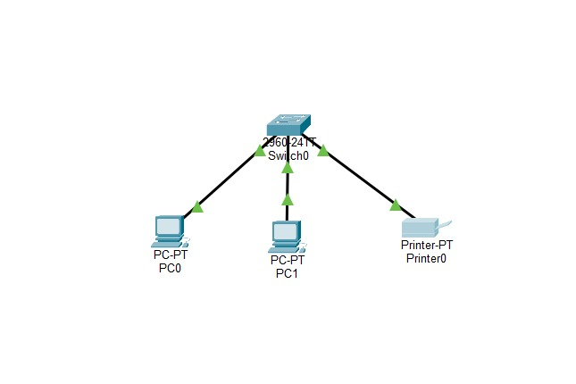
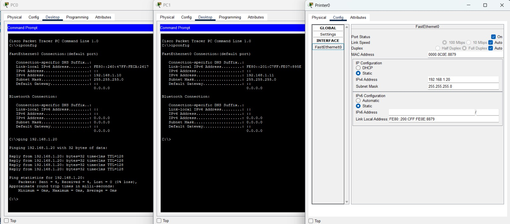

# Lab 01 · Red local con switch

Primer laboratorio práctico de redes. Diseñé una red local (LAN) en Cisco Packet Tracer con un switch Cisco 2960 que conecta dos computadoras y una impresora mediante cableado de cobre directo. Configuré direccionamiento IP estático en la red `192.168.1.0/24` y verifiqué la comunicación entre los equipos con los comandos `ipconfig` y `ping`, obteniendo 0% de pérdida de paquetes.

## 🎯 Objetivo

Construir una red local (LAN) con un switch que conecte dos computadoras y una impresora, asignar direcciones IP estáticas y comprobar la comunicación entre los equipos.

## 🗺️ Topología

## 🖥️ Equipos utilizados

| Equipo | Modelo | Cantidad |
|---|---|---|
| Switch | Cisco 2960 | 1 |
| PC | PC-PT | 2 |
| Impresora | Printer-PT | 1 |
| Cable | Cobre directo (straight-through) | 3 |

## 🔢 Tabla de direccionamiento

**Red:** `192.168.1.0/24`

| Dispositivo | Interfaz | Puerto del switch | Dirección IP | Máscara |
|---|---|---|---|---|
| PC0 | FastEthernet0 | Fa0/1 | 192.168.1.10 | 255.255.255.0 |
| PC1 | FastEthernet0 | Fa0/2 | 192.168.1.11 | 255.255.255.0 |
| Impresora | FastEthernet0 | Fa0/3 | 192.168.1.20 | 255.255.255.0 |

## ⚙️ Configuración

1. Se conectaron los equipos al switch con cable de cobre directo, ya que son dispositivos de distinto tipo.
2. Se asignaron direcciones IP estáticas a cada equipo dentro de la misma red.
3. No se configuró puerta de enlace, porque todos los equipos pertenecen a la misma red.

## ✅ Pruebas

### Configuración IP y conectividad (`ipconfig` y `ping`)

Ping desde PC0 hacia la impresora: **4 paquetes enviados, 4 recibidos, 0% de pérdida.**

## 🧠 Conclusiones

- El switch permite la comunicación entre equipos dentro de la misma red local.
- Con ipconfig verifique la configuración de cada pc, ping para ver la comunicación de manera correcta.

## 📂 Archivos

- [`lab01-red-local.pkt`](./lab01-red-local.pkt) → abrir con Cisco Packet Tracer
