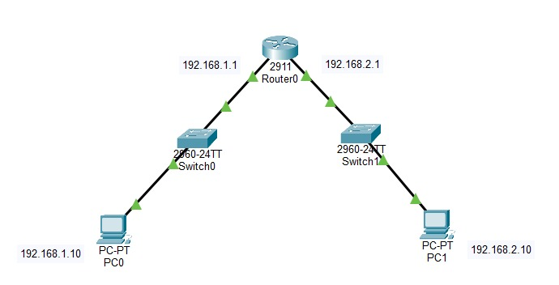
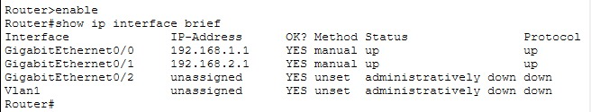
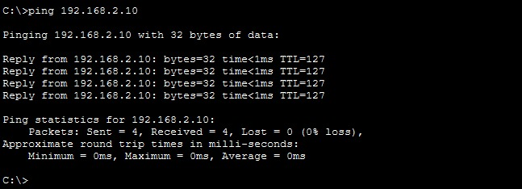

# Lab 02 · Router conectando dos redes

Segundo laboratorio práctico de redes. Diseñé en Cisco Packet Tracer dos redes locales independientes (`192.168.1.0/24` y `192.168.2.0/24`) y las comuniqué mediante un router Cisco 2911. Configuré las interfaces del router por línea de comandos (CLI), asigné la puerta de enlace a cada computadora y verifiqué la comunicación entre redes con `ping`, obteniendo 0% de pérdida de paquetes.

## 🎯 Objetivo

Comunicar dos redes distintas a través de un router, configurando sus interfaces por CLI y la puerta de enlace de cada equipo.

## 🗺️ Topología



## 🖥️ Equipos utilizados

| Equipo | Modelo | Cantidad |
|---|---|---|
| Router | Cisco 2911 | 1 |
| Switch | Cisco 2960 | 2 |
| PC | PC-PT | 2 |
| Cable | Cobre directo (straight-through) | 4 |

## 🔢 Tabla de direccionamiento

| Dispositivo | Interfaz | Dirección IP | Máscara | Puerta de enlace |
|---|---|---|---|---|
| Router0 | G0/0 | 192.168.1.1 | 255.255.255.0 | — |
| Router0 | G0/1 | 192.168.2.1 | 255.255.255.0 | — |
| PC0 | FastEthernet0 | 192.168.1.10 | 255.255.255.0 | 192.168.1.1 |
| PC1 | FastEthernet0 | 192.168.2.10 | 255.255.255.0 | 192.168.2.1 |

## ⚙️ Configuración del router

```
enable
configure terminal
interface g0/0
ip address 192.168.1.1 255.255.255.0
no shutdown
exit
interface g0/1
ip address 192.168.2.1 255.255.255.0
no shutdown
end
copy running-config startup-config
```

## ✅ Pruebas

### Estado de las interfaces (`show ip interface brief`)

Ambas interfaces configuradas aparecen en estado `up/up`.



### Conectividad entre redes (`ping`)

Ping desde PC0 (`192.168.1.10`) hacia PC1 (`192.168.2.10`): **4 paquetes enviados, 4 recibidos, 0% de pérdida.** El valor `TTL=127` confirma que el paquete atravesó el router.



## 🛠️ Problema encontrado y solución

El primer ping falló con 100% de pérdida. Al revisar `ipconfig`, la puerta de enlace estaba en `0.0.0.0`, por lo que la PC no sabía a dónde enviar el tráfico destinado a otra red. Se configuró la puerta de enlace correcta en cada PC, una IP del router dentro de su propia red, y la comunicación funcionó.

## 🧠 Conclusiones

- La PC0 detectó que el destino estaba fuera de su red, pero al no tener configurada la puerta de enlace, el ping falló. Al configurarla, la PC ya sabía a dónde enviar el paquete y la comunicación fue exitosa.
- El comando `copy running-config startup-config` sirve para guardar toda la configuración hecha en el router, para que no se pierda al reiniciarlo.

## 📂 Archivos

- [`lab02-router-dos-redes.pkt`](./lab02-router-dos-redes.pkt) → abrir con Cisco Packet Tracer